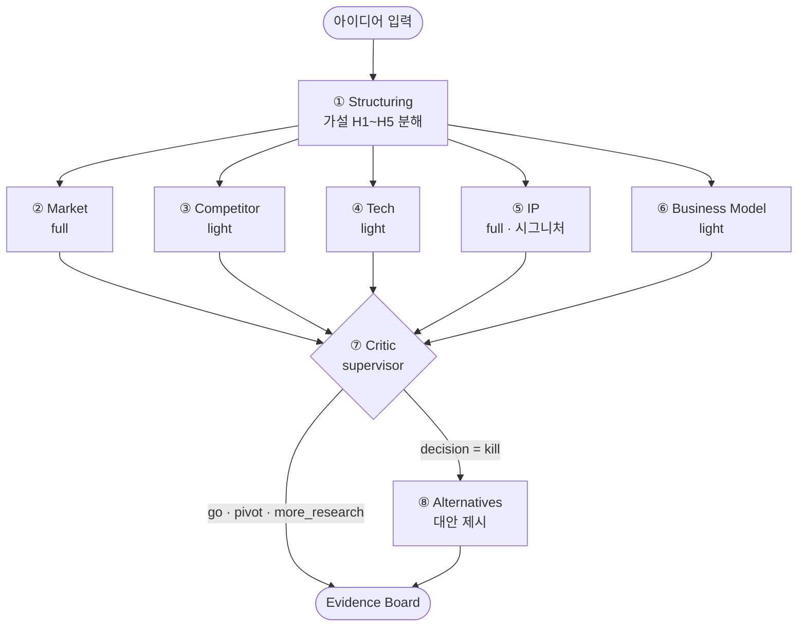

# VentureScout

**Evidence 기반 창업 실사 멀티 에이전트** — 창업 아이디어를 검증 가능한 가설로 분해하고, 실제 특허·시장 데이터에서 근거를 찾아 **상충하는 증거까지 함께** Evidence Board에 드러낸 뒤, Critic 에이전트가 낙관 편향을 걷어내고 `Go / Pivot / Kill / More Research` 판정과 다음 검증 실험을 제안합니다.

> **포트폴리오 사본입니다.** 4인 팀 프로젝트이며, 저는 **Track A — 데이터 수집·적재**를 담당했습니다.
> 담당 범위는 [내 담당 범위](#내-담당-범위--track-a-데이터-수집적재)에 정리했고, 나머지 트랙은 팀원들의 작업입니다.
> 원본 팀 레포 · 전체 커밋 히스토리와 팀원 기여는 그대로 보존되어 있습니다 → [de-ai-AIAgentPJ-team4/venturescout](https://github.com/de-ai-AIAgentPJ-team4/venturescout)

---

## 문제의식

창업 아이디어 검증에 LLM을 쓰면 대부분 **"좋은 아이디어네요"로 끝납니다.** 근거 없이 긍정하고, 불리한 정보는 언급하지 않고, 판단의 출처를 추적할 수 없습니다.

VentureScout는 세 가지로 이 문제에 접근합니다.

1. **모든 주장에 근거 ID를 붙인다** — 각 에이전트 출력의 `grounded_on` 필드가 실제 DB의 `evidence_items`를 가리킵니다. 근거 없는 주장은 `overclaim`으로 집계됩니다.
2. **반증을 우대해서 검색한다** — rerank 4축 중 하나가 `contradiction_value`입니다. 아이디어를 지지하는 근거만 모이지 않도록 설계했습니다.
3. **Critic이 감독자로 마지막에 개입한다** — 5개 분석 에이전트의 결론을 검수하고 반박(objection)을 달아 판정을 교정합니다. 이 교정 효과는 **Critic ON/OFF 비교 하네스**로 측정합니다.

---

## 아키텍처

LangGraph 기반 **8노드 그래프**. Structuring이 가설을 만들면 5개 분석 에이전트가 **병렬 실행**되고, Critic이 전체를 검수합니다. `kill` 판정일 때만 Alternatives 노드가 추가로 실행됩니다.



Structuring은 아이디어를 **5개 축의 검증 가능한 가설**로 분해합니다.

| 가설 | 축 | 담당 에이전트 |
|---|---|---|
| H1 | `customer_problem` | ② Market |
| H2 | `competition` | ③ Competitor |
| H3 | `business_model` | ⑥ Business Model |
| H4 | `technology` | ④ Tech |
| H5 | `ip` | ⑤ IP |

가설 문장(`statement`)과 특허 키워드는 **영어로 생성**됩니다 — 영문 특허 임베딩(PatentSBERTa)에 그대로 검색 쿼리로 들어가기 때문입니다.

---

## 핵심 기술

### 1. 2단계 하이브리드 검색

pgvector(의미)와 tsvector(키워드)를 결합하되, **인덱스를 실제로 타도록** 2단계로 나눴습니다.

```
① 후보 생성 (각각 인덱스 사용)
   vec CTE : ORDER BY embedding <=> query  LIMIT pool   → HNSW 인덱스
   kw  CTE : WHERE tsv @@ q ORDER BY ts_rank LIMIT pool → GIN 인덱스
② 합성 점수
   두 후보의 합집합(≤ 2·pool 행)에만 가중합 hybrid_score 계산 → top_k
```

단순히 전체 테이블에 가중합을 계산하면 인덱스를 못 타고 풀스캔이 됩니다. 후보를 먼저 좁히고 그 위에서만 합성 점수를 계산하는 구조입니다.

### 2. 4축 rerank

검색 결과를 `relevance · reliability · freshness · contradiction_value` 4축으로 재정렬합니다. **`contradiction_value`가 이 프로젝트의 설계 의도**입니다 — 반증 근거에 가중치를 줘서 Evidence Board에 상충 정보가 반드시 올라오게 합니다.

### 3. 특허 청구항 중첩 신호 (시그니처)

특허를 문서 단위가 아니라 **청구항 구성요소(`claim_limitations`) 단위로 분해·임베딩**합니다. 아이디어의 기술 요소와 기존 특허 청구항의 구성요소를 대조해 중첩 후보(`ip_overlap_candidates`)를 뽑아냅니다. 공개 특허 데이터를 쓰기 때문에 출처가 명확하고 검증 가능합니다.

### 4. 평가 하네스 — Critic ON/OFF

멀티에이전트 구조가 실제로 값을 하는지 측정하기 위해, **동일 아이디어를 Critic 있이/없이 N회씩** 돌려 분포를 비교합니다.

| 지표 | 정의 |
|---|---|
| `change_rate` | N회 중 Critic이 판정을 바꾼 비율 |
| `objections_mean` / `stdev` | Critic이 추가한 반박 수의 평균·표준편차 |
| `on_decision_distribution` | Critic ON일 때 판정 분포 |
| `json_validity` | 에이전트 출력이 계약 스키마를 만족한 비율 |
| `groundedness` | `grounded_on`이 실제 근거를 가리키는 비율 |
| `overclaim_count` | 근거 없이 단정한 주장 수 |
| `critic_latency_overhead_s` | Critic 도입에 따른 지연 증가분 |

실 LLM 연결 후 그래프가 비결정적이 되어, 단발 비교에서 **N회 반복·분포 집계**로 격상했습니다 (ADR-030 → ADR-035). 구현: [eval/harness.py](eval/harness.py)

---

## 내 담당 범위 — Track A (데이터 수집·적재)

에이전트들이 근거로 삼는 **모든 데이터의 수집·저장 파이프라인 전 구간**을 맡았습니다.
`BigQuery(공개 특허) → S3 → PostgreSQL` 경로와, 경쟁사 분석용 시드 데이터셋 구축입니다.

| 범위 | 내용 | 코드 |
|---|---|---|
| **수집** | Google BigQuery 공개 특허 데이터셋(`patents-public-data.patents.publications`)에서 CPC `G06Q30`(이커머스·추천) 특허를 **연도별로 분할 수집** → S3 적재. 실행 시 S3 객체 키를 파싱해 **이미 수집된 연도를 건너뛰는 중복 방지** 로직 포함 | [data/collect_from_bigquery.py](data/collect_from_bigquery.py) |
| **적재** | S3의 **최신 파일 자동 탐색** 후 PostgreSQL 배치 적재. 청구항을 구성요소 단위로 파싱해 `patent_claims` / `claim_limitations`에 분해 저장 | [data/load_from_s3.py](data/load_from_s3.py) |
| **오케스트레이션**<br>*(연습용)* | 주간 증분 갱신 Airflow DAG. `extract → load → embed → verify` 4단계. **Airflow 비의존 순수 함수와 `@task` 데코레이터를 분리**해 테스트 가능하게 구성, 단계별 재시도 정책 차등 적용, S3 `head_object` 기반 **멱등 추출**(재실행 안전), 주간 소량 배치엔 HNSW 인덱스 재빌드를 건너뛰도록 처리, 마지막 `verify_sync`에서 건수 불일치 시 실행 실패 처리 | [dags/](dags/) · [설계 문서](docs/superpowers/specs/2026-06-22-patent-weekly-refresh-dag-design.md) · [구현 계획](docs/superpowers/plans/2026-06-22-patent-weekly-refresh-dag.md) |
| **시드 데이터** | B2B SaaS · Fintech · HR Tech **90개사**를 `competitors` / `pricing` / `reviews` 3종 스키마로 정규화 → **JSON 270개** 직접 구축. 통화 단위 통일 및 DB 스키마 정합 작업 포함. 90개 파일을 직접 대조해 **스키마 정의 문서**로 정리 (필드 규약, jsonb 검증 책임 경계, `ext_id` 전역 UNIQUE 제약) | [data/SEED_DATA_FORMAT.md](data/SEED_DATA_FORMAT.md) · [data/competitors/](data/competitors/) · [data/pricing/](data/pricing/) · [data/reviews/](data/reviews/) · [data/load_seed.py](data/load_seed.py) |
| **인프라** | 로컬 PostgreSQL → **AWS RDS 연결 전환** (`sslmode=verify-full` + CA 번들) | [data/](data/) · [db/](db/) |
| **에이전트 기여** | Solution Advisor 에이전트 설계 문서 작성 | [설계 문서](docs/superpowers/specs/2026-06-19-solution-advisor-agent-design.md) |
| | Critic 판정 규칙에 **Kill 조건** 추가 | [agents/graph.py](agents/graph.py) |

<details>
<summary>내 커밋만 보기</summary>

```bash
git log --author="songareum" --oneline --no-merges
```
</details>

---

## 팀 구성 (4인)

| 트랙 | 담당 | 에이전트 |
|---|---|---|
| **A** 👈 *본인* | **데이터 수집·저장(파싱·적재)** | — |
| B | 검색·임베딩 | ② Market(full), ③ Competitor(light) |
| C | 에이전트 플랫폼(척추·계약) | ① Structuring, ④ Tech, ⑤ IP(시그니처), ⑦ Critic, ⑧ Alternatives |
| D | 백엔드·UI·평가 | ⑥ Business Model(light) |

핵심 경계: **시그니처 기계(파싱=A / 검색·임베딩=B)는 DB·tool 계층에, ⑤·④ 에이전트는 그 결과를 읽어와 LLM 판정만 수행.** 척추(State·그래프·⑦·그라운딩)는 C 단독 소유입니다.

---

## 스택

| 레이어 | 기술 |
|---|---|
| 에이전트 | LangGraph (StateGraph, 조건부 라우팅) |
| LLM | AWS Bedrock · `ChatBedrockConverse` · Claude Sonnet 4.6 |
| 저장소 | PostgreSQL(AWS RDS) 단일 스토어 — pgvector(HNSW) + tsvector(GIN) |
| 임베딩 | PatentSBERTa 768d (영문 특허 특화) |
| 백엔드 | FastAPI — `POST /analyze` SSE 스트리밍 |
| 프런트 | Chainlit — 단계별 진행 렌더 + Evidence Board |
| 파이프라인 | BigQuery · S3 · boto3 · Airflow(연습용) |
| 실행 | Docker Compose (컨테이너 Python 3.11) |
| 관측 | LangSmith 트레이싱 (선택 — 미설정 시 완전 no-op) |

### 데이터 모델 (9 테이블)

```
ideas · analysis_jobs · hypotheses          ← 입력과 실행 단위
documents · evidence_items                  ← 근거 (임베딩 + 전문검색)
agent_runs                                  ← 에이전트 출력 (계약 준수)
patent_claims · claim_limitations           ← 특허 청구항 분해 (시그니처)
ip_overlap_candidates                       ← 청구항 중첩 후보
```

스키마 정의: [db/init.sql](db/init.sql) · [db/schema.dbml](db/schema.dbml) · [docs/schema_tier0.md](docs/schema_tier0.md)

---

## 프로젝트 구조

```
shared/       계약 — contracts.py / state.py (cross-team 인터페이스)
db/           스키마 — init.sql(9 tables) / schema.dbml
data/         Track A — BigQuery 수집 · S3 적재 · 시드 데이터
dags/         Track A — 주간 증분 갱신 Airflow DAG (연습용)
pipeline/     청킹 · 임베딩 · pgvector 인덱싱 · 영속화
search/       하이브리드 검색(hybrid.py) · 4축 rerank(reranker.py)
retrieval/    Track B — 검색 tool + ②③ 에이전트
agents/       Track C — LangGraph 8노드 + 그라운딩 · 가드레일
app/          Track D — FastAPI(api.py) · Chainlit(ui.py)
eval/         평가 하네스 — Critic ON/OFF 비교
tests/        계약 · 노드 · 검색 파이프라인 테스트
docs/         설계 문서 · 워크스루
```

---

## 실행

DB는 외부 AWS RDS를 사용합니다. Compose는 `api` · `ui` 두 서비스만 띄웁니다.

```bash
cp .env.example .env       # AWS 자격증명 · RDS 접속정보 채우기 (.env 는 절대 커밋 금지)
docker compose up --build  # API :8000 · Chainlit :8001
```

브라우저에서 `http://localhost:8001` 접속 후 창업 아이디어를 입력하면, 7~8개 노드의 진행 상황이 실시간으로 스트리밍되고 마지막에 Evidence Board가 렌더링됩니다.

| 엔드포인트 | 설명 |
|---|---|
| `GET /health` | 헬스체크 |
| `POST /analyze` | 분석 실행 — SSE로 `job` / `stage` / `report` 이벤트 스트리밍 |

> 로컬 Python 3.14에서는 의존성 비호환으로 실행되지 않습니다. **Docker(3.11) 실행이 표준**입니다 (ADR-025).

### 테스트

```bash
docker compose run --rm api pytest
```

7개 파일 · 45개 테스트 — 계약 검증, Critic 판정 규칙, Alternatives 노드, 모델 라우팅, Track B 검색 파이프라인, live 그래프(monkeypatch로 RDS 없이 실행).

---

## 문서

프로젝트의 모든 결정은 ADR로 기록했습니다 — **총 38건**.

| 문서 | 내용 |
|---|---|
| [AIAgentPJ_ADR_v7.md](AIAgentPJ_ADR_v7.md) | 최신 ADR (v1~v7 누적, 결정·구현·레포 상태) |
| [docs/venturescout_full_walkthrough.md](docs/venturescout_full_walkthrough.md) | 전체 동작 워크스루 |
| [docs/track_b_search_pipeline.md](docs/track_b_search_pipeline.md) | 검색·임베딩 파이프라인 설계 |
| [docs/schema_tier0.md](docs/schema_tier0.md) | 데이터 계약 · 스키마 정의 |
| [data/SEED_DATA_FORMAT.md](data/SEED_DATA_FORMAT.md) | 시드 데이터 포맷 규약 |
| [docs/superpowers/specs/](docs/superpowers/specs/) | 기능별 설계 문서 |

주요 설계 결정 몇 가지:

- **PostgreSQL 단일 스토어** — 별도 벡터 DB(Chroma 등)를 두지 않고 pgvector + tsvector로 통합. 근거와 메타데이터가 한 트랜잭션 안에 있어야 그라운딩 추적이 깨지지 않기 때문 (ADR-001, ADR-020)
- **계약 우선** — `shared/contracts.py`의 strict 필드(`evidence_id` · `grounded_on` · `confidence` · `stance` · `depth`)는 고정, 분석 본문은 `output_json`으로 느슨하게. 4개 트랙이 병렬 작업하면서도 인터페이스가 깨지지 않게 (ADR-016)
- **mock 전면 제거** — 개발 초기의 mock 검색을 모두 걷어내고 `RETRIEVAL=live` 전용으로 강제. mock과 실제 결과의 미스매치가 평가를 오염시켰기 때문 (ADR-037, 설계 reversal)

---

## 발표 자료

프로젝트 발표 PPT는 아래 노션 페이지에 있습니다.

**▶ [VentureScout 발표 자료 (Notion)](https://app.notion.com/p/venturescout-ppt-3c07197ee65280e88bdcec935c6d7721?source=copy_link)**
