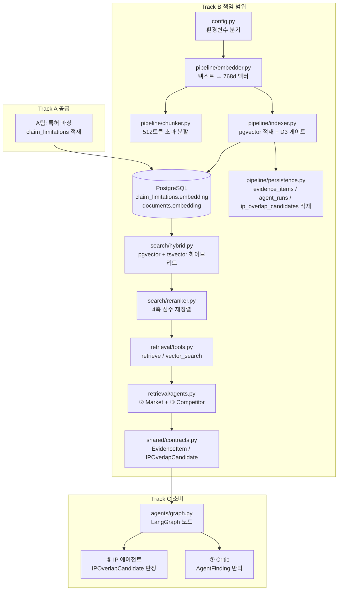
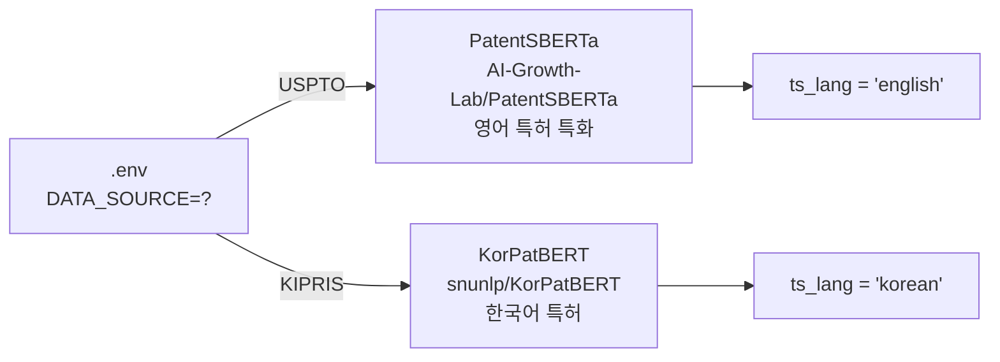
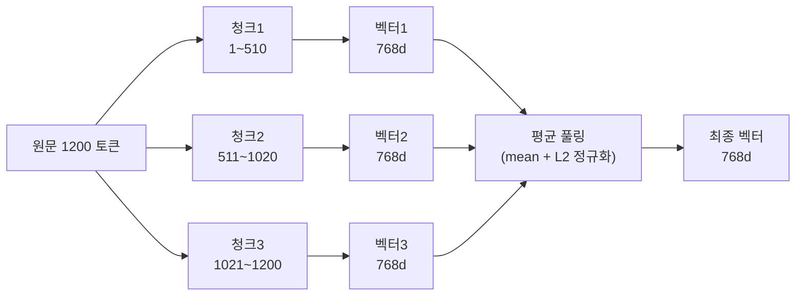
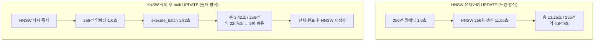
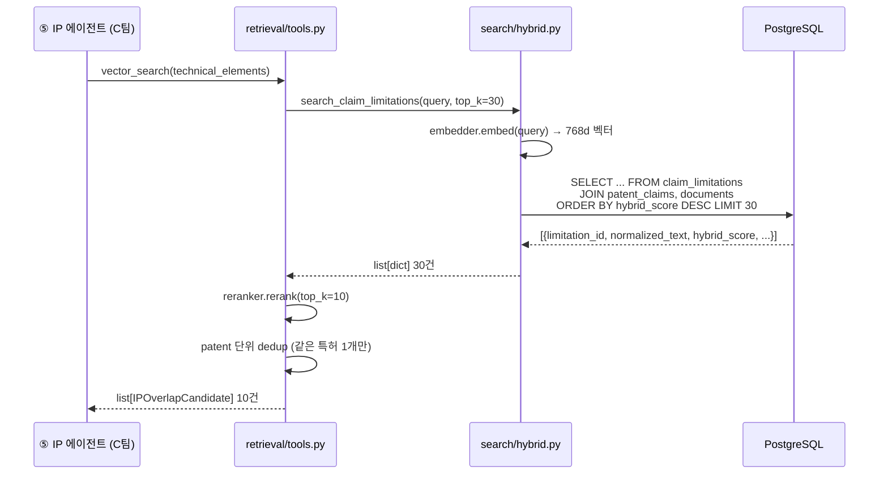
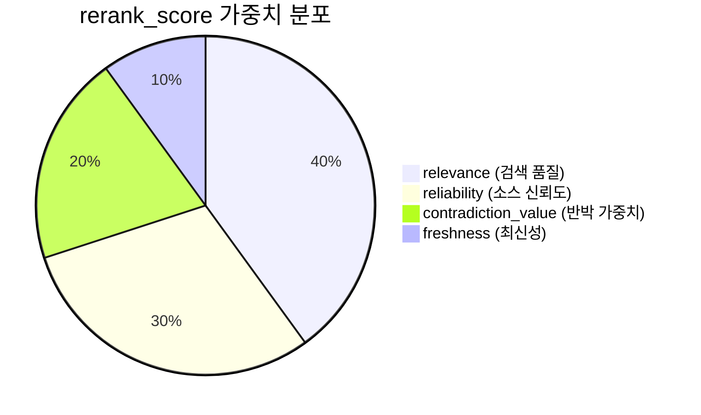
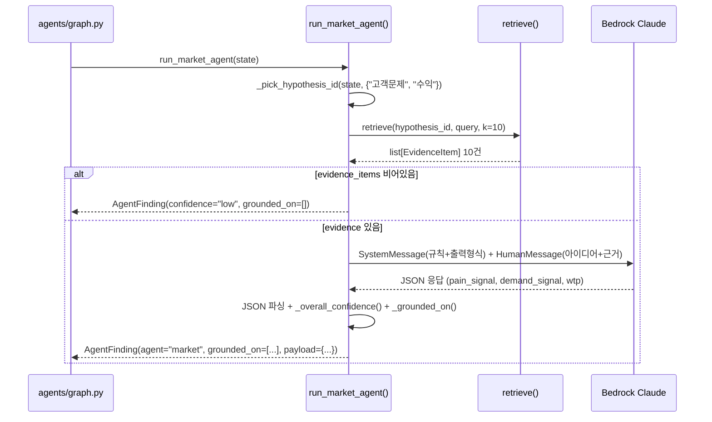
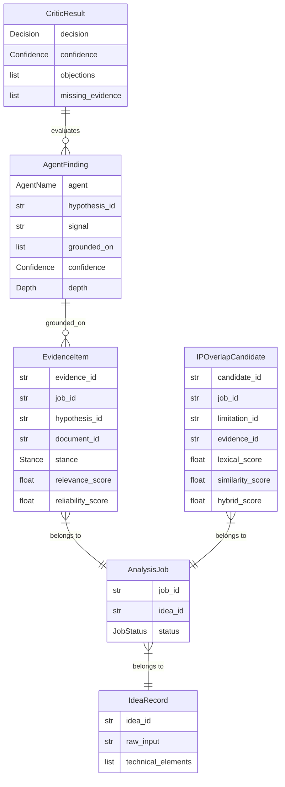
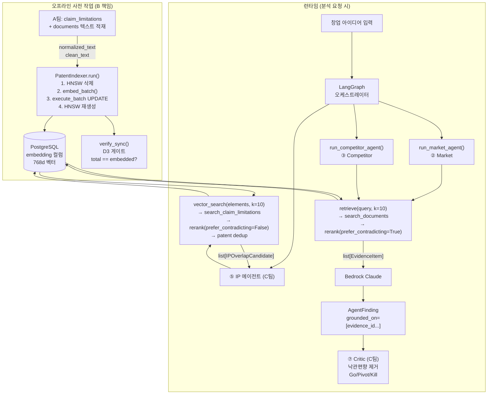

# Track B 코드 워크스루 — 팀원 설명 자료

> Track B 담당: 검색·임베딩 파이프라인 + 에이전트 ②③  
> 이 문서는 각 파일이 **왜 존재하는지**, **어떤 Python/SQL 문법을 쓰는지** 코드 수준으로 설명한다.

---

## 0. 전체 구조 한 눈에 보기



**데이터 흐름 요약**
1. A팀이 특허를 파싱해 `claim_limitations` / `documents` 테이블에 텍스트를 넣는다.  
2. B(indexer)가 그 텍스트를 읽어 PatentSBERTa로 임베딩하고 `embedding` 컬럼에 저장한다.  
3. C팀 에이전트가 `vector_search()` / `retrieve()`를 호출하면 B의 검색 레이어가 결과를 반환한다.  
4. B가 직접 소유한 ②③ 에이전트는 결과를 LLM으로 분석해 `AgentFinding`을 만든다.

---

## 1. `config.py` — 환경 변수 싱글턴

### 역할
`.env`의 환경변수를 한 곳에서 읽고, `DATA_SOURCE=USPTO/KIPRIS` 하나만 바꾸면 임베딩 모델·DB 언어·신뢰도가 연쇄로 결정된다.

### 주요 Python 문법

```python
# ① dataclass + field — 데이터 클래스로 설정 묶기
from dataclasses import dataclass, field

@dataclass          # 클래스를 자동으로 __init__, __repr__ 등 생성
class Config:
    data_source: str = os.getenv("DATA_SOURCE", "USPTO")
    # os.getenv(key, default) — 환경변수 없으면 기본값 반환

    source_reliability: dict = field(default_factory=lambda: {
        "patent": 0.9,          # lambda: {} — 가변 기본값은 field로 감싸야 버그 없음
    })

    def __post_init__(self):    # dataclass 초기화 직후 자동 호출되는 hook
        if not self.embedding_model:
            if self.data_source == "KIPRIS":
                self.embedding_model = os.getenv("EMBEDDING_MODEL", "snunlp/KorPatBERT")
            else:
                self.embedding_model = os.getenv("EMBEDDING_MODEL", "AI-Growth-Lab/PatentSBERTa")

    @property               # ② @property — 메서드를 속성처럼 접근 가능
    def db_dsn(self) -> str:
        from urllib.parse import quote_plus
        return (
            f"postgresql://{self.db_user}:{quote_plus(self.db_password)}"
            f"@{self.db_host}:{self.db_port}/{self.db_name}"
        )   # quote_plus: 비밀번호에 특수문자(#, @, :) 있어도 URL 안전하게 인코딩

    @property
    def is_korean(self) -> bool:
        return self.data_source == "KIPRIS"

config = Config()   # 모듈 레벨 싱글턴 — import하면 항상 같은 인스턴스
```

### DATA_SOURCE 분기 흐름



---

## 2. `pipeline/chunker.py` — 512토큰 분할기

### 역할
BERT 계열 모델은 입력 토큰 수가 512개로 제한된다. 특허 청구항이 이 한도를 초과하면 뒷부분이 잘린다. Chunker는 텍스트를 토큰 단위로 510조각(CLS/SEP 2토큰 제외)으로 분할해 준다.

### 주요 Python 문법

```python
from __future__ import annotations  # Python 3.9 이하에서도 | 타입 힌트 사용 가능

from typing import TYPE_CHECKING
if TYPE_CHECKING:                    # 타입 힌트용 import — 런타임에는 실행 안 됨
    from transformers import PreTrainedTokenizer


class PatentChunker:
    def __init__(self, tokenizer: "PreTrainedTokenizer", max_tokens: int = 512):
        self._effective_max = max_tokens - 2   # CLS + SEP 토큰 자리 제외

    def split(self, text: str) -> list[str]:
        token_ids = self.tokenizer.encode(text, add_special_tokens=False)
        # encode() — 텍스트를 정수 ID 리스트로 변환 ([101, 2054, 2003, ...])

        if len(token_ids) <= self._effective_max:
            return [text]              # 512 이하면 그냥 반환

        chunks: list[str] = []
        for start in range(0, len(token_ids), self._effective_max):
            # range(start, stop, step) — 510 단위로 슬라이딩
            chunk_ids = token_ids[start : start + self._effective_max]
            chunk_text = self.tokenizer.decode(chunk_ids, skip_special_tokens=True)
            # decode() — ID 리스트를 다시 텍스트로 복원
            chunks.append(chunk_text)

        return chunks
```

### 청크 분할 예시



---

## 3. `pipeline/embedder.py` — 임베딩 모델 래퍼

### 역할
PatentSBERTa(영어)와 KorPatBERT(한국어) 두 모델을 동일한 인터페이스로 사용할 수 있도록 래핑한다. `config.is_korean`에 따라 내부 구현만 달라진다.

### 주요 Python 문법

```python
class PatentEmbedder:
    def __init__(self):
        self._model = None        # ① lazy init 패턴 — 첫 호출 시에만 모델 로드

    def _load(self):
        if self._model is not None:   # 이미 로드됐으면 즉시 반환
            return
        if config.is_korean:
            self._load_korpatbert()
        else:
            self._load_patent_sbert()

    def embed(self, text: str) -> np.ndarray:
        self._load()               # 매번 체크하지만 실제 로드는 최초 1회만
        chunks = self._chunker.split(text)

        if len(chunks) == 1:
            return self._embed_single(chunks[0])

        # ② np.stack — 여러 배열을 새 축으로 쌓아 2D 배열 생성
        vecs = np.stack([self._embed_single(c) for c in chunks])
        # [벡터1(768,), 벡터2(768,)] → (2, 768) 행렬

        avg = vecs.mean(axis=0)    # axis=0: 행 방향 평균 → (768,)
        return (avg / np.linalg.norm(avg)).astype(np.float32)
        # L2 정규화: v / |v| → 코사인 유사도 계산을 내적만으로 가능하게

    def embed_batch(self, texts: list[str], batch_size: int = 32) -> np.ndarray:
        # ③ sentence-transformers .encode() — GPU/MPS 배치 처리 최적화
        return self._model.encode(
            texts,
            batch_size=batch_size,
            normalize_embeddings=True,  # L2 정규화 자동
            show_progress_bar=True,
        ).astype(np.float32)
```

#### KorPatBERT Mean Pooling (직접 구현)

```python
def _korpatbert_mean_pool(self, text: str) -> np.ndarray:
    inputs = self._tokenizer(text, return_tensors="pt", truncation=True)
    # return_tensors="pt" — PyTorch 텐서로 반환

    with torch.no_grad():        # 그래디언트 계산 비활성 (추론 시 메모리 절약)
        outputs = self._bert_model(**inputs)
        # **inputs: dict를 키워드 인자로 언팩 (input_ids=..., attention_mask=...)

    token_embeddings = outputs.last_hidden_state   # shape: (1, seq_len, 768)
    attention_mask = inputs["attention_mask"]       # shape: (1, seq_len)

    # attention mask를 768차원으로 확장해 PAD 토큰 기여 0으로 만들기
    mask_expanded = attention_mask.unsqueeze(-1).expand(token_embeddings.size()).float()
    sum_embeddings = (token_embeddings * mask_expanded).sum(dim=1)  # (1, 768)
    sum_mask = mask_expanded.sum(dim=1).clamp(min=1e-9)             # 0 나누기 방지
    mean_pooled = (sum_embeddings / sum_mask).squeeze(0).numpy()    # (768,)

    return (mean_pooled / np.linalg.norm(mean_pooled)).astype(np.float32)
```

---

## 4. `pipeline/indexer.py` — pgvector 적재 + D3 게이트

### 역할
A팀이 넣어둔 텍스트를 읽어 임베딩하고 DB에 업데이트한다. HNSW 인덱스를 임베딩 전에 삭제하고 완료 후 재생성해 5배 속도 향상을 달성한다.

### 핵심 발견: HNSW 인덱스 병목



### 주요 Python 문법

```python
import psycopg2.extras

class PatentIndexer:
    @property                           # 지연 연결 — DB 연결을 처음 쓸 때만 생성
    def conn(self):
        if self._conn is None or self._conn.closed:
            self._conn = psycopg2.connect(config.db_dsn)
            register_vector(self._conn)  # pgvector 타입 등록
        return self._conn

    def run(self, batch_size: int = 256) -> dict:
        self._drop_hnsw_indexes()        # 1. 인덱스 먼저 삭제
        result = {
            "claim_limitations": self.run_claim_limitations(batch_size),
            "documents":         self.run_documents(batch_size),
        }
        self._rebuild_hnsw_indexes()     # 3. 완료 후 재생성
        return result

    def _fetch_unembedded(self, table, id_col, text_col, batch_size) -> Iterator[list[dict]]:
        with self.conn.cursor(cursor_factory=psycopg2.extras.DictCursor) as cur:
            # DictCursor — row를 dict처럼 접근 가능: row["limitation_id"]
            cur.execute(f"""
                SELECT {id_col}, {text_col}
                FROM {table}
                WHERE embedding IS NULL AND {text_col} IS NOT NULL
                ORDER BY {id_col}
            """)
            while True:                  # ① 제너레이터 패턴 — 메모리 효율
                rows = cur.fetchmany(batch_size)   # 한 번에 256건만 가져옴
                if not rows:
                    break
                yield [dict(r) for r in rows]      # yield: 호출자에게 값 넘기고 일시 정지

    def _update_embedding_batch(self, table, id_col, pairs):
        with self.conn.cursor() as cur:
            psycopg2.extras.execute_batch(
                cur,
                f"UPDATE {table} SET embedding = %s WHERE {id_col} = %s",
                pairs,           # [(벡터1, id1), (벡터2, id2), ...]
                page_size=256,   # ② execute_batch — 256건 묶어서 한 번에 전송
            )                    # 일반 executemany 대비 DB round-trip 대폭 감소
```

### D3 게이트 (동기화 검증)

```python
def verify_sync(self) -> dict:
    """임베딩 완료 후 반드시 실행. 불일치 시 ⑤ IP 에이전트 결과가 조용히 망가짐."""
    with self.conn.cursor() as cur:
        cur.execute("SELECT COUNT(*) FROM claim_limitations")
        total = cur.fetchone()[0]
        cur.execute("SELECT COUNT(*) FROM claim_limitations WHERE embedding IS NOT NULL")
        embedded = cur.fetchone()[0]

    return {
        "total_limitations": total,
        "total_embedded":    embedded,
        "missing":           total - embedded,
        "sync_rate":         (embedded / total) if total else 0.0,
        "gate_pass":         total == embedded,   # True면 ⑤ 사용 가능
    }
```

---

## 5. `search/hybrid.py` — 하이브리드 검색

### 역할
의미(벡터) 검색과 키워드 검색을 0.6:0.4로 합산한다. 특허 기술용어는 의미 공간에서 멀어도 키워드로 정확히 매칭되는 경우가 많아 두 점수를 합산한다.

### 하이브리드 점수 공식

```
hybrid_score = 0.6 × (1 - cosine_distance(query_vec, embedding))
             + 0.4 × ts_rank(normalized_text, query)
```

### SQL 패턴 분석

```sql
-- ① pgvector 연산자
1 - (cl.embedding <=> %(vec)s::vector)
-- <=> : 코사인 거리 (0 = 동일, 2 = 반대)
-- 1 - 거리 = 유사도 (1 = 동일)
-- %(vec)s::vector : psycopg2 파라미터를 pgvector 타입으로 캐스팅

-- ② tsvector 전문검색
ts_rank(
    to_tsvector('english', cl.normalized_text),  -- 텍스트를 검색 인덱스 형태로 변환
    plainto_tsquery('english', %(query)s)        -- 검색어를 쿼리 형태로 변환
)
-- ts_rank(): 빈도·위치 기반 관련성 점수 (0~1 아님, 상대값)

-- ③ 동적 WHERE 절 구성
conditions = ["cl.embedding IS NOT NULL", "d.source_type = 'patent'"]
if independent_only:
    conditions.append("pc.is_independent = TRUE")
if code_filter:
    conditions.append("d.meta->>'cpc_code' LIKE %(code)s")
    # ->>' : JSONB에서 텍스트값 추출 (meta 컬럼은 jsonb 타입)

where_clause = " AND ".join(conditions)
# → "cl.embedding IS NOT NULL AND d.source_type = 'patent' AND pc.is_independent = TRUE"
```

### 검색 흐름 (claim_limitations)



### Python 동적 쿼리 구성 패턴

```python
# 조건을 리스트로 쌓고 AND로 합치기 — 안전한 동적 SQL 생성
conditions = ["cl.embedding IS NOT NULL"]
params: dict = dict(vec=query_vec.tolist(), query=query, top_k=top_k)

if independent_only:
    conditions.append("pc.is_independent = TRUE")
if code_filter:
    conditions.append("d.meta->>'cpc_code' LIKE %(code)s")
    params["code"] = f"{code_filter}%"

where_clause = " AND ".join(conditions)
# %(name)s 스타일 — psycopg2 named parameter (SQL injection 방지)
```

---

## 6. `search/reranker.py` — 4축 리랭크

### 역할
하이브리드 검색이 반환한 후보 중 "근거로서 가장 가치 있는" 것을 재정렬한다. 특히 **반박 근거를 의도적으로 상위에 올려** Evidence Board의 찬반 충돌 신호를 만든다.

### 4축 점수 공식

```
rerank_score = 0.4 × relevance         (하이브리드 검색 점수)
             + 0.3 × reliability        (소스 신뢰도)
             + 0.1 × freshness          (최신성)
             + 0.2 × contradiction_value (반박 근거 가중치)
```

### contradiction_value 값 결정

| stance | prefer_contradicting=True | prefer_contradicting=False |
|--------|--------------------------|---------------------------|
| `contradicts` | **1.0** | 0.5 |
| `supports` | 0.2 | 0.2 |
| `neutral` | 0.5 | 0.5 |

### 주요 Python 문법

```python
class ReRanker:
    def __init__(self, relevance_w=None, reliability_w=None, ...):
        self.w = {
            "relevance":   relevance_w   or config.rerank_relevance_w,
            # or 연산자: None 또는 0.0이면 config 값 사용
        }

    def rerank(self, candidates, prefer_contradicting=True, top_k=None):
        top_k = top_k or config.top_k_return
        scored = [self._score(item, prefer_contradicting) for item in candidates]
        # 리스트 컴프리헨션 — 각 아이템에 _score 적용

        scored.sort(key=lambda x: x["rerank_score"], reverse=True)
        # sort의 key 매개변수 — lambda로 정렬 기준 지정
        # reverse=True — 내림차순 (높은 점수가 앞)

        return scored[:top_k]   # 슬라이싱으로 상위 k개 반환

    def _score(self, item, prefer_contradicting):
        # freshness 동적 계산 (meta.filing_date → 출원년도 기준 선형 감쇠)
        meta = item.get("meta") or {}
        filing_date_str = str(meta.get("filing_date", "")) if isinstance(meta, dict) else ""
        if filing_date_str and len(filing_date_str) >= 4:
            import datetime
            try:
                years_ago = datetime.date.today().year - int(filing_date_str[:4])
                freshness = max(0.0, 1.0 - years_ago / 20.0)
                # 20년 이상 된 특허는 freshness = 0
                # 최신 특허는 freshness ≈ 1.0
            except (ValueError, TypeError):
                pass

        return {
            **item,                          # 기존 dict 언팩 (spread 연산자)
            "rerank_score": round(score, 4),
            "_debug": {...},                 # 디버깅용 각 축 점수
        }
```

### 가중치별 역할



---

## 7. `retrieval/tools.py` — 에이전트 호출 API

### 역할
C팀 에이전트가 검색을 쓸 때의 인터페이스. 내부 구현(hybrid.py, reranker.py)을 숨기고 `shared/contracts.py`에 정의된 타입으로만 결과를 반환한다.

### 두 함수의 차이

| 함수 | 대상 테이블 | 반환 타입 | 소비자 |
|------|-----------|---------|-------|
| `retrieve()` | `documents` | `EvidenceItem` | ② Market, ③ Competitor |
| `vector_search()` | `claim_limitations` | `IPOverlapCandidate` | ⑤ IP |

### 주요 Python 문법

```python
# ① 모듈 레벨 싱글턴 — import 시 한 번만 생성
_searcher = HybridSearcher()
_reranker = ReRanker()


def retrieve(
    hypothesis_id: str,
    query: str,
    *,              # * 이후는 keyword-only 인자 — 호출 시 반드시 이름 지정
    job_id: str = "",
    k: int = 5,
) -> list[EvidenceItem]:
    raw = _searcher.search_documents(query=query, top_k=k * 2)  # 2배 더 가져와서
    ranked = _reranker.rerank(raw, prefer_contradicting=True, top_k=k)  # k개로 줄임

    return [
        EvidenceItem(                           # ② Pydantic 모델로 변환
            evidence_id=str(item["document_id"]),
            job_id=job_id,
            hypothesis_id=hypothesis_id,
            document_id=str(item["document_id"]),
            source_type=item["source_type"],
            evidence_text=str(item["clean_text"])[:1000],  # 텍스트 1000자 제한
            stance=item.get("stance", "neutral"),   # .get(key, default) — 없으면 기본값
            relevance_score=float(item.get("hybrid_score") or 0.0),
            reliability_score=float(item.get("reliability_score") or 0.0),
        )
        for item in ranked
    ]


def vector_search(
    technical_elements: list[str],
    *,
    job_id: str = "",
    hypothesis_id: str = "",
    k: int = 10,
) -> list[IPOverlapCandidate]:
    query = " ".join(technical_elements)   # ["STT", "요약"] → "STT 요약"

    raw = _searcher.search_claim_limitations(query=query, top_k=k * 3)
    ranked = _reranker.rerank(raw, prefer_contradicting=False, top_k=k * 3)

    # ③ 같은 특허에서 나온 limitation 중 rerank_score 최상위 1개만 유지
    seen_patents: set[str] = set()
    deduped = []
    for item in ranked:
        pid = item.get("patent_id")
        if pid not in seen_patents:          # set은 O(1) 조회
            seen_patents.add(pid)
            deduped.append(item)
        if len(deduped) >= k:
            break

    return [
        IPOverlapCandidate(
            candidate_id=str(uuid.uuid4()),  # uuid4() — 랜덤 UUID 생성
            ...
            lexical_score=float(item.get("lexical_score") or 0.0),
            similarity_score=float(item.get("similarity_score") or 0.0),
            hybrid_score=float(item["hybrid_score"]),
            rank=rank,
        )
        for rank, item in enumerate(deduped, start=1)
        # enumerate(iterable, start=1) — (1, item1), (2, item2), ...
    ]
```

---

## 8. `retrieval/agents.py` — ② Market & ③ Competitor 에이전트

### 역할
B가 직접 소유한 ② Market과 ③ Competitor 에이전트 본체. `retrieve()`로 근거를 가져오고, Bedrock Claude로 분석한 뒤, `AgentFinding`으로 반환한다.

### ② Market 에이전트 흐름



### 주요 Python 문법

```python
# ① Lazy LLM 초기화 — AWS 자격증명 검증을 첫 호출 시로 미룸
_llm: ChatBedrockConverse | None = None

def _get_llm() -> ChatBedrockConverse:
    global _llm          # 함수 안에서 모듈 변수를 수정할 때 global 선언
    if _llm is None:
        _llm = ChatBedrockConverse(model_id=config.bedrock_model_id, ...)
    return _llm


# ② 가설 찾기 — duck typing으로 dict/객체 모두 처리
def _pick_hypothesis_id(state, axes: set[str]) -> str:
    for h in state.get("hypotheses", []):
        axis = h.axis if hasattr(h, "axis") else h.get("axis")
        # hasattr: 속성 있는지 확인 → Pydantic 모델이면 .axis, dict면 .get("axis")
        if axis in axes:         # set 멤버십 검사 — O(1)
            return h.hypothesis_id if hasattr(h, "hypothesis_id") else h["hypothesis_id"]
    return "H0"


# ③ 가장 낮은 confidence를 최종 confidence로 (보수적 집계)
_CONF_LEVEL = {"high": 3, "mid": 2, "low": 1}

def _overall_confidence(result: dict) -> str:
    confidences = [
        _CONF_MAP.get(str(result.get(key, {}).get("confidence", "low")).lower(), "low")
        for key in ("pain_signal", "demand_signal", "willingness_to_pay")
    ]
    return min(confidences, key=lambda c: _CONF_LEVEL[c])
    # min의 key 매개변수 — _CONF_LEVEL로 변환한 값 중 최솟값의 원래 문자열 반환


# ④ LLM 호출 + JSON 파싱 + 실패 처리
response = _get_llm().invoke(messages)
raw = response.content.strip()

try:
    result = json.loads(raw)
except json.JSONDecodeError:          # JSON 파싱 실패 시 대응
    logger.error(f"[② Market] JSON 파싱 실패: {raw[:200]}")
    result = {"pain_signal": {"summary": raw[:200], ...}, ...}


# ⑤ grounded_on 집계 — LLM이 인용 안 했으면 검색된 전체 evidence_id로 폴백
def _grounded_on(result, evidence_items, keys):
    cited: set[str] = set()
    for key in keys:
        cited.update(result.get(key, {}).get("evidence_ids", []) or [])
        # update(): set에 iterable 추가 (중복 자동 제거)
    if cited:
        return sorted(cited)                        # 정렬된 리스트로 반환
    return [e.evidence_id for e in evidence_items]  # 폴백: 전체 evidence_id
```

### ② Market vs ③ Competitor 비교

| 항목 | ② Market (Full) | ③ Competitor (Light) |
|------|----------------|---------------------|
| 검색 k | 10건 | 6건 (상위 3건만 LLM에 전달) |
| depth | `"full"` | `"light"` |
| confidence | 동적 계산 | 항상 `"low"` 고정 |
| 분석 내용 | pain/demand/wtp 3축 | competitor_matrix (갭 신호 수준) |
| 목적 | 폭 증명 | 경쟁 존재 확인만 (Tier 1에서 심화) |

---

## 9. `shared/contracts.py` — 팀 간 계약 스키마

### 역할
C팀이 Day 1에 정의한 Pydantic 모델. 모든 팀이 이 파일의 타입으로 데이터를 주고받는다. B팀이 반환하는 `EvidenceItem`, `IPOverlapCandidate`도 여기에 있다.

### Pydantic 모델 핵심 문법

```python
from pydantic import BaseModel, Field
from typing import Literal, Any

# ① Literal — 허용 값을 명시적으로 제한
Confidence = Literal["high", "mid", "low"]
Stance = Literal["supports", "contradicts", "neutral"]

class EvidenceItem(BaseModel):
    evidence_id: str
    job_id: str = ""        # = "" — 기본값 지정
    hypothesis_id: str
    stance: Stance          # "supports"|"contradicts"|"neutral" 외 값 입력 시 ValidationError
    relevance_score: float = 0.0
    reliability_score: float    # 기본값 없음 — 필수 필드

class AgentRun(BaseModel):
    grounded_on: list[str] = Field(..., min_length=1)
    # Field(...) : 필수 필드 (... = Ellipsis)
    # min_length=1 : 빈 리스트 금지 — grounded_on 없으면 ValidationError

    output_json: dict[str, Any] = Field(default_factory=dict)
    # default_factory : 가변 기본값 안전하게 생성 (= {} 는 위험)

class IPOverlapCandidate(BaseModel):
    """기계가 만든 후보 — C팀이 판단하기 전 중립 상태."""
    candidate_id: str
    lexical_score: float
    similarity_score: float
    hybrid_score: float
    rank: int

# 하위호환 별칭 — 예전 코드가 OverlapCandidate를 써도 에러 안 남
OverlapCandidate = IPOverlapCandidate
```

### 모델 관계도



---

## 10. `pipeline/persistence.py` — DB 쓰기 레이어

### 역할
B가 소유한 3개 테이블(`evidence_items`, `agent_runs`, `ip_overlap_candidates`)에 데이터를 쓰는 함수 모음.

### 주요 SQL 패턴

```python
def create_evidence_item(conn, *, job_id, hypothesis_id, ...) -> str:
    with conn.cursor() as cur:
        cur.execute(
            """
            INSERT INTO evidence_items
                (job_id, hypothesis_id, document_id, source_type, ...)
            VALUES (%s, %s, %s, %s, ...)
            RETURNING evidence_id     -- ① RETURNING — INSERT 결과를 즉시 반환
            """,
            (job_id, hypothesis_id, document_id, source_type, ...),
            # %s 플레이스홀더 + 튜플 — SQL injection 방지 (절대 f-string으로 값 넣지 않음)
        )
        evidence_id = cur.fetchone()[0]   # RETURNING 결과 가져오기
    conn.commit()
    return str(evidence_id)


def create_ip_overlap_candidates(conn, *, job_id, hypothesis_id, ...) -> list[str]:
    candidate_ids: list[str] = []
    for rank, c in enumerate(candidates, start=1):
        # ② 먼저 evidence_items에 neutral stance로 삽입 (중첩 판단은 C팀 몫)
        evidence_id = create_evidence_item(conn, ..., stance="neutral")

        with conn.cursor() as cur:
            cur.execute(
                """INSERT INTO ip_overlap_candidates (...) VALUES (...) RETURNING candidate_id""",
                (...),
            )
            candidate_ids.append(str(cur.fetchone()[0]))

    conn.commit()    # ③ 모든 행 INSERT 후 한 번에 commit (트랜잭션)
    return candidate_ids


# ④ LangGraph RunnableConfig에서 context 추출 헬퍼
def _job_context(run_config) -> tuple[str | None, str | None]:
    cfg = (run_config or {}).get("configurable", {})
    return cfg.get("job_id"), cfg.get("hypothesis_id")
    # 파이프라인이 job_id 없이 동작할 때도 crash 없이 None 반환


def persist_agent_output(run_config, *, agent_name, ...) -> str | None:
    job_id, hypothesis_id = _job_context(run_config)
    if not job_id:
        return None    # job_id 없으면 조용히 skip — Tier0 호환성 유지
    ...
```

---

## 11. 전체 데이터 흐름 요약



---

## 12. 팀원이 B 코드를 쓸 때 알아야 할 것

### 검색 tool 호출 방법

```python
# ② Market / ③ Competitor용 — documents 검색
from retrieval.tools import retrieve

evidence_items = retrieve(
    hypothesis_id="H1",
    query="회의 자동 정리 고객 불만",
    job_id="job-uuid",  # 있으면 DB 적재됨, 없어도 동작
    k=10,
)
# 반환: list[EvidenceItem]
# evidence_items[0].evidence_id — grounded_on에 그대로 넣을 ID
# evidence_items[0].stance — "supports"|"contradicts"|"neutral"

# ⑤ IP용 — claim_limitations 검색
from retrieval.tools import vector_search

candidates = vector_search(
    technical_elements=["음성인식", "회의 요약", "STT"],
    job_id="job-uuid",
    hypothesis_id="H5",
    k=10,
)
# 반환: list[IPOverlapCandidate]
# candidates[0].hybrid_score — 유사도 점수
# candidates[0].limitation_id — 매칭된 특허 limitation
```

### D3 게이트 확인

```python
from pipeline.indexer import PatentIndexer

result = PatentIndexer().verify_sync()
if not result["gate_pass"]:
    print(f"임베딩 누락 {result['missing']}건 — indexer.run() 재실행 필요")
```

### 환경 변수 체크

```bash
# .env 필수 항목
DATA_SOURCE=USPTO                   # USPTO | KIPRIS
POSTGRES_HOST=your-rds-host.rds.amazonaws.com
POSTGRES_PORT=5432
POSTGRES_DB=venturescout
POSTGRES_USER=postgres
POSTGRES_PASSWORD=your_password     # 따옴표 없이
AWS_REGION=ap-northeast-1
BEDROCK_MODEL_ID=jp.anthropic.claude-sonnet-4-6
```

---

## 13. 파일별 담당 역할 한 줄 요약

| 파일 | 한 줄 요약 |
|------|-----------|
| `config.py` | 환경변수 → 설정 싱글턴 (DATA_SOURCE로 임베딩 모델 자동 결정) |
| `pipeline/chunker.py` | 512토큰 초과 텍스트 분할 |
| `pipeline/embedder.py` | 텍스트 → 768d 벡터 (PatentSBERTa/KorPatBERT 공통 인터페이스) |
| `pipeline/indexer.py` | 텍스트 → pgvector 적재 + D3 게이트 (HNSW 최적화 포함) |
| `pipeline/persistence.py` | evidence_items / agent_runs / ip_overlap_candidates DB 쓰기 |
| `search/hybrid.py` | pgvector + tsvector 0.6:0.4 합산 검색 |
| `search/reranker.py` | 4축(relevance·reliability·freshness·contradiction) 재정렬 |
| `retrieval/tools.py` | retrieve() / vector_search() — C팀 에이전트 호출 인터페이스 |
| `retrieval/agents.py` | ② Market + ③ Competitor 에이전트 본체 |
| `shared/contracts.py` | 팀 간 계약 Pydantic 모델 (EvidenceItem, IPOverlapCandidate 등) |
