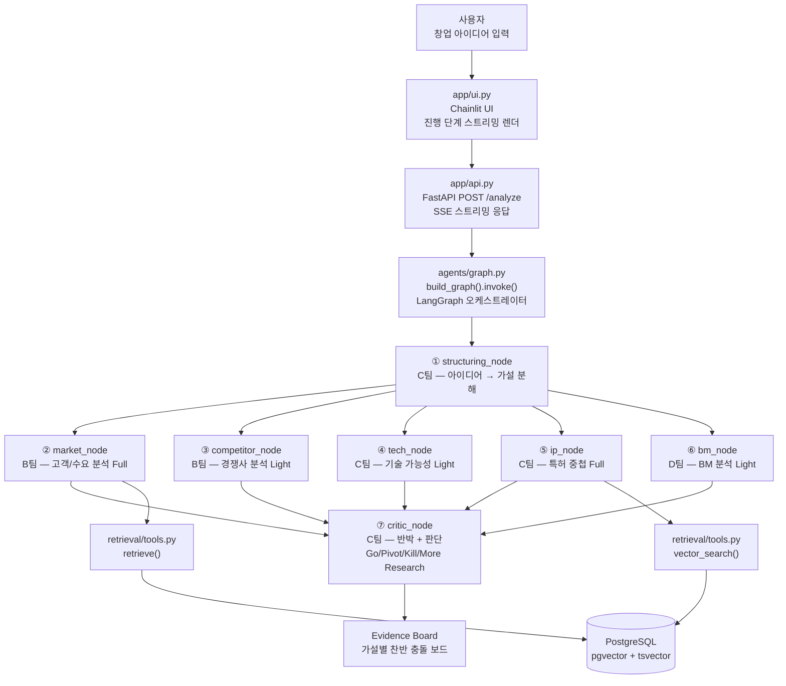
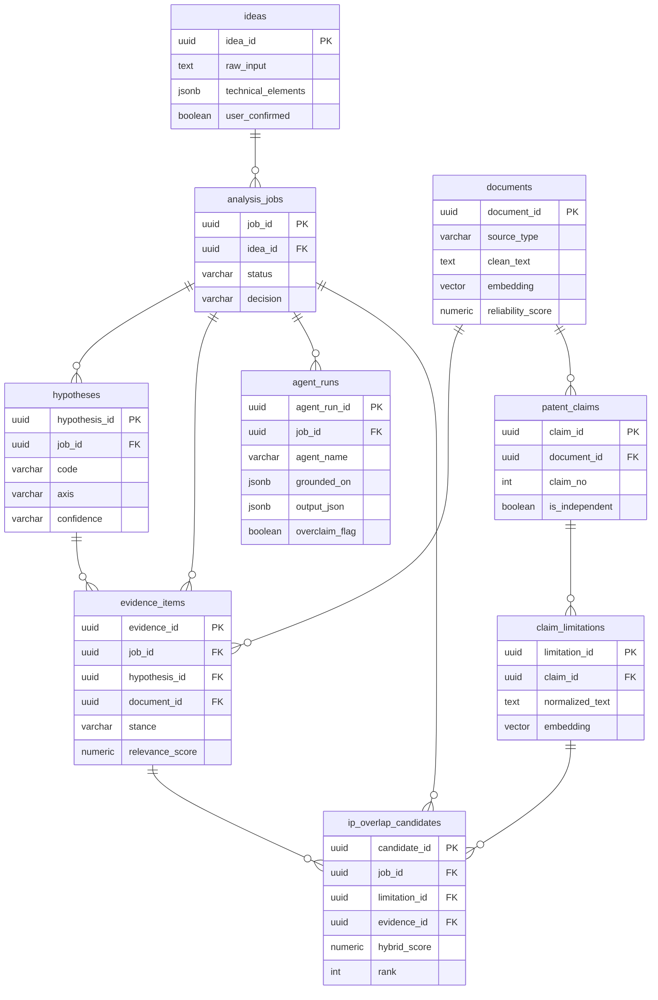
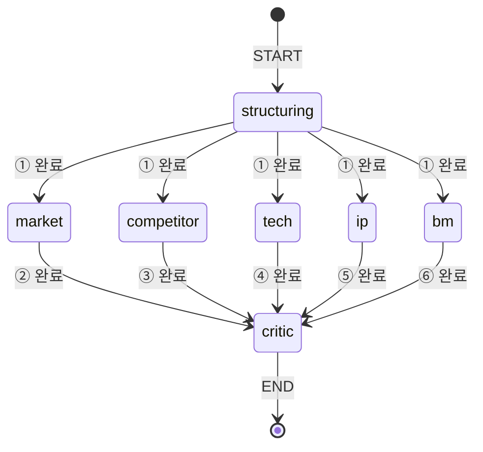
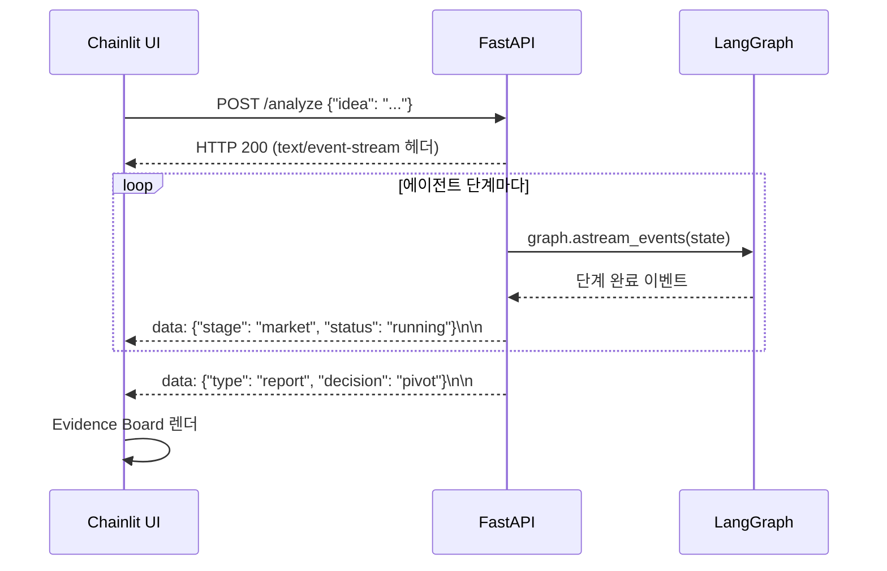
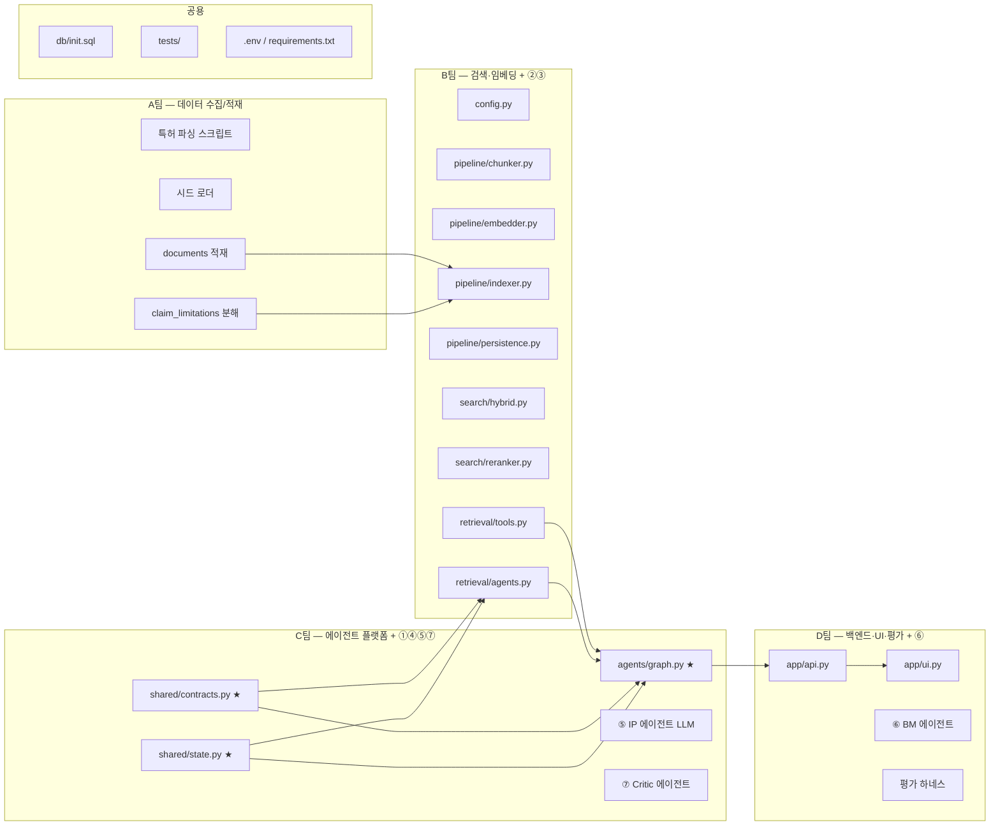

# VentureScout 전체 프로젝트 코드 워크스루

> 4인 협업 멀티에이전트 시스템 — 창업 아이디어 증거 기반 검증  
> 이 문서는 venturescout 폴더 전체 파일을 **왜 있는지 + 어떤 문법을 쓰는지** 설명한다.  
> Track B 내부 상세(임베딩·검색·에이전트②③)는 `docs/track_b_code_walkthrough.md` 참조.

---

## 0. 프로젝트 전체 구조

```
venturescout/
├── config.py                  ← 환경변수 싱글턴 (DATA_SOURCE → 임베딩 모델 자동 결정)
├── db/
│   ├── init.sql               ← PostgreSQL 9테이블 스키마 + 인덱스 DDL
│   └── schema.dbml            ← dbdiagram.io 시각화용 ERD
├── shared/
│   ├── contracts.py           ← 팀 간 계약 Pydantic 모델 (Day 1 확정, 변경 금지)
│   └── state.py               ← LangGraph State TypedDict
├── pipeline/                  ← B 소유: 임베딩 파이프라인
│   ├── chunker.py
│   ├── embedder.py
│   ├── indexer.py
│   └── persistence.py
├── search/                    ← B 소유: 검색 레이어
│   ├── hybrid.py
│   ├── reranker.py
│   └── tool.py                ← @tool 데코레이터 (C팀 에이전트 바인딩)
├── retrieval/                 ← B 소유: 에이전트 ②③ + 도구 API
│   ├── tools.py
│   └── agents.py
├── agents/
│   └── graph.py               ← C 소유: LangGraph 7노드 그래프 (척추)
├── app/
│   ├── api.py                 ← D 소유: FastAPI 비동기 job + SSE 스트리밍
│   └── ui.py                  ← D 소유: Chainlit Evidence Board
└── tests/
    ├── test_contracts.py      ← 계약 스키마 회귀 테스트
    └── test_track_b.py        ← Track B 단위 테스트
```

---

## 1. 전체 실행 흐름



---

## 2. `db/init.sql` — 데이터베이스 스키마

### 역할
시스템의 모든 데이터를 담는 9개 테이블을 정의한다. PostgreSQL 하나가 운영 DB·근거 저장소·벡터 검색 엔진을 겸한다(별도 벡터DB 없음).

### 9테이블 관계도



### 주요 SQL 문법 해설

```sql
-- ① PostgreSQL 확장 모듈 로드
CREATE EXTENSION IF NOT EXISTS vector;       -- pgvector: embedding 컬럼 + HNSW 인덱스
CREATE EXTENSION IF NOT EXISTS "uuid-ossp"; -- uuid_generate_v4() 함수 사용

-- ② UUID 기본키 + 자동 생성
CREATE TABLE ideas (
    idea_id uuid PRIMARY KEY DEFAULT uuid_generate_v4(),
    -- uuid: 128비트 고유 식별자. 분산 환경에서 충돌 없이 생성 가능
    -- DEFAULT uuid_generate_v4(): INSERT 시 자동 생성 (명시 안 해도 됨)

    technical_elements jsonb,
    -- jsonb: JSON을 바이너리로 저장 (json보다 조회 빠름)
    -- ->>' 연산자로 값 추출: meta->>'cpc_code'

    created_at timestamptz DEFAULT now()
    -- timestamptz: 타임존 포함 타임스탬프
);

-- ③ 외래키(참조 무결성)
CREATE TABLE analysis_jobs (
    job_id  uuid PRIMARY KEY DEFAULT uuid_generate_v4(),
    idea_id uuid REFERENCES ideas(idea_id),
    -- REFERENCES: idea_id가 ideas 테이블에 존재하는 값만 허용
    status  varchar(20)  -- 고정 길이 문자열: 'pending'|'running'|'done'|'failed'
);

-- ④ pgvector: 768차원 임베딩 컬럼
CREATE TABLE documents (
    embedding  vector(768)   -- 768d float32 벡터 저장
);
CREATE TABLE claim_limitations (
    embedding  vector(768)
);

-- ⑤ HNSW 인덱스 — 근사 최근접 이웃 검색 (ANN)
CREATE INDEX idx_doc_embed ON documents
    USING hnsw (embedding vector_cosine_ops);
-- hnsw: 계층적 탐색 가능 소세계 그래프 (HNSWLIB 알고리즘)
-- vector_cosine_ops: 코사인 유사도 기준으로 인덱스 구성

-- ⑥ GIN 인덱스 — 전문 검색 (tsvector)
CREATE INDEX idx_doc_text ON documents
    USING gin (to_tsvector('simple', coalesce(clean_text, '')));
-- gin: Generalized Inverted Index — 단어→행 역색인
-- to_tsvector: 텍스트를 형태소 분석한 검색 인덱스 형태로 변환
-- coalesce(clean_text, ''): NULL이면 빈 문자열 대체 (NULL 인덱스 오류 방지)
```

### 테이블별 소유 팀

| 테이블 | 쓰는 팀 | 읽는 팀 | 역할 |
|--------|---------|---------|------|
| `ideas` | C(①) | 전체 | 구조화된 아이디어 입력 |
| `analysis_jobs` | D(FastAPI) | 전체 | 비동기 job 상태 추적 |
| `hypotheses` | C(①) | B,C,D | H1~H5 가설 Ledger |
| `documents` | A | B | 특허+시드+웹 원문+임베딩 |
| `evidence_items` | B | C,D | 그라운딩 원자 (모든 주장이 인용) |
| `agent_runs` | B,C,D | D(평가) | 에이전트 출력 envelope |
| `patent_claims` | A | B | 특허 청구항 |
| `claim_limitations` | A,B | B(검색) | 청구항 구성요소+임베딩 |
| `ip_overlap_candidates` | B | C(⑤) | 기계가 만든 중첩 후보 |

---

## 3. `shared/contracts.py` — 팀 간 계약 스키마

### 역할
Day 1에 C팀이 레포에 올려 모든 팀이 합의한 계약 파일. **이 파일의 인터페이스가 바뀌면 4팀 전체에 영향이 간다.** 필드를 추가하는 건 괜찮지만 이름/타입 변경은 먼저 팀 공유 필수.

### 주요 Python 문법

```python
from pydantic import BaseModel, Field
from typing import Literal, Any

# ① Literal — 허용값을 타입 수준에서 제한
Confidence = Literal["high", "mid", "low"]     # 이 외의 값 → ValidationError
Stance     = Literal["supports", "contradicts", "neutral"]
Decision   = Literal["go", "pivot", "kill", "more_research"]
AgentName  = Literal["structuring", "market", "competitor", "tech", "ip", "bm", "critic"]

# ② BaseModel 기본 패턴
class EvidenceItem(BaseModel):
    evidence_id:      str        # 필수 (기본값 없음)
    job_id:           str = ""   # 선택 (기본값 빈 문자열)
    stance:           Stance     # Literal 검증
    relevance_score:  float = 0.0
    reliability_score: float     # 필수

# ③ Field — 추가 검증 규칙
class AgentRun(BaseModel):
    grounded_on: list[str] = Field(..., min_length=1)
    # Field(...): 필수 필드 (Ellipsis = "required"의 의미)
    # min_length=1: 빈 리스트 금지 → grounded_on 없으면 ValidationError

    output_json: dict[str, Any] = Field(default_factory=dict)
    # default_factory: 가변(mutable) 기본값을 안전하게 선언
    # dict()/list() 등은 클래스 공유 버그 있어 반드시 factory 사용

# ④ 하위호환 별칭
OverlapCandidate = IPOverlapCandidate
# 이전 코드가 OverlapCandidate를 참조해도 에러 없이 동작
```

### 계약 사용 예시

```python
# Pydantic은 생성 시 자동 검증
from shared.contracts import EvidenceItem

# 올바른 사용
item = EvidenceItem(
    evidence_id="ev_001",
    hypothesis_id="H1",
    document_id="doc_123",
    source_type="seed_review",
    evidence_text="...",
    stance="contradicts",     # Literal 검증 통과
    reliability_score=0.6,
)

# 잘못된 stance 값 → ValidationError 즉시 발생
item = EvidenceItem(..., stance="maybe")  # ValueError!

# 모델 직렬화
item.model_dump()        # dict로 변환
item.model_dump_json()   # JSON 문자열로 변환
```

---

## 4. `shared/state.py` — LangGraph State

### 역할
LangGraph 그래프가 노드 간에 공유하는 데이터 컨테이너. 각 노드는 이 State를 받고 일부를 업데이트해서 반환한다.

### 주요 Python 문법

```python
from typing import TypedDict
from shared.contracts import Hypothesis, EvidenceItem, AgentFinding, CriticResult

class VentureScoutState(TypedDict, total=False):
    # ① TypedDict — dict처럼 동작하지만 각 키의 타입이 명시됨
    # total=False: 모든 키가 선택적 (없어도 에러 없음)
    # → 각 노드가 자기 담당 키만 업데이트해도 됨

    idea:         dict                             # ① 출력
    hypotheses:   list[Hypothesis]
    evidence_pool: dict[str, EvidenceItem]         # {evidence_id: EvidenceItem}
    findings:     list[AgentFinding]               # ②~⑥ 누적
    critic:       CriticResult                     # ⑦ 출력
    final_report: str
```

### TypedDict vs Pydantic 비교

| 항목 | TypedDict (State) | Pydantic (contracts) |
|------|-------------------|---------------------|
| 용도 | LangGraph 런타임 상태 | 팀 간 메시지 계약 |
| 검증 | 타입 힌트만 (런타임 검증 없음) | 생성 시 자동 검증 |
| 직렬화 | `dict` 그대로 | `model_dump()` 필요 |
| 왜 이걸 쓰나 | LangGraph가 dict 기반 동작 | 경계값 방어 |

---

## 5. `agents/graph.py` — LangGraph 7노드 그래프

### 역할
7개 에이전트 노드를 연결해 창업 아이디어 분석 워크플로우를 구성하는 C팀의 척추(backbone). ① → ②③④⑤⑥ 병렬 → ⑦ 순서로 실행된다.

### 실행 순서 흐름



### 주요 Python / LangGraph 문법

```python
from langgraph.graph import StateGraph, START, END
from shared.state import VentureScoutState

# ① StateGraph — 상태 기반 그래프 빌더
def build_graph():
    g = StateGraph(VentureScoutState)
    # StateGraph(State타입): 이 타입의 dict를 노드 간에 전달

    # ② add_node(이름, 함수) — 노드 등록
    for name, fn in [
        ("structuring", structuring_node),
        ("market",      market_node),
        # ...
    ]:
        g.add_node(name, fn)
        # fn: (state: VentureScoutState) -> dict 형태여야 함
        # 반환 dict의 키가 state에 merge됨

    # ③ add_edge — 노드 실행 순서 연결
    g.add_edge(START, "structuring")           # 시작점 → ①

    for n in ["market", "competitor", "tech", "ip", "bm"]:
        g.add_edge("structuring", n)           # ① 완료 → ②③④⑤⑥ 병렬 시작
        g.add_edge(n, "critic")                # ②~⑥ 각각 완료 → ⑦에 수렴

    g.add_edge("critic", END)                  # ⑦ → 종료

    return g.compile()                         # ④ compile() — 실행 가능한 그래프로 변환


# ⑤ 노드 함수 패턴
def market_node(state: VentureScoutState) -> dict:
    # 입력: 전체 state
    # 출력: 업데이트할 키:값 dict (전체 state 반환 안 해도 됨)
    return {"findings": [run_market_agent(state)]}
    # findings 키만 업데이트 → state["findings"]에 누적됨


# ⑥ 현재 stub 상태의 노드 예시
def _leaf_finding(agent: str, depth: str) -> AgentFinding:
    return AgentFinding(
        agent=agent, hypothesis_id="H0", signal=f"[MOCK] {agent}",
        grounded_on=["ev_mock_0001"],     # mock 근거
        confidence="low", depth=depth,
    )
```

### 그래프 직접 실행 방법

```python
# __main__ 블록 — python agents/graph.py 로 직접 테스트 가능
if __name__ == "__main__":
    graph = build_graph()
    result = graph.invoke({
        "idea": {"technical_elements": ["STT", "요약"]}
    })
    # invoke(): 동기 실행. 비동기는 ainvoke()
    print(result)
```

### 각 노드별 소유 현황

| 노드 | 에이전트 | 소유 | 현재 상태 | Depth |
|------|---------|------|-----------|-------|
| `structuring_node` | ① 구조화 | C | TODO (LLM 미연결) | - |
| `market_node` | ② Market | **B** | **실구현** (`run_market_agent`) | Full |
| `competitor_node` | ③ Competitor | **B** | **실구현** (`run_competitor_agent`) | Light |
| `tech_node` | ④ Tech | C | Mock | Light |
| `ip_node` | ⑤ IP | C | `vector_search` 호출만 | Full |
| `bm_node` | ⑥ BM | D | Mock | Light |
| `critic_node` | ⑦ Critic | C | Mock | - |

---

## 6. 검색 모듈 정리 — `retrieval/tools.py`가 canonical

초기엔 검색 진입점이 두 갈래로 중복돼 있었다:

- `retrieval/tools.py` — `retrieve()` / `vector_search()`, **contract 타입**(`EvidenceItem`, `IPOverlapCandidate`) 반환. `agents/graph.py`·`retrieval/agents.py`가 실제로 import.
- ~~`search/tool.py`~~ — `@tool` 래핑 버전, raw `dict` 반환. **어디서도 import되지 않는 죽은 중복 코드**였다.

둘 다 `HybridSearcher`+`ReRanker`를 똑같이 래핑하고 특허 dedup 로직까지 중복 구현했기 때문에, live LangGraph 경로에 연결돼 있고 계약 타입을 반환하는 **`retrieval/tools.py`를 canonical로 확정**하고 `search/tool.py`를 삭제했다.

검색 스택의 최종 레이어 구조:

| 레이어 | 모듈 | 책임 |
|--------|------|------|
| 엔진 (SQL) | `search/hybrid.py` | pgvector + tsvector 하이브리드 쿼리 |
| 엔진 (rerank) | `search/reranker.py` | relevance·reliability·freshness·contradiction 4축 재정렬 |
| 툴 인터페이스 | `retrieval/tools.py` | 엔진 래핑 + 특허 dedup → **contract 타입 반환** |
| 에이전트 | `retrieval/agents.py` | ② Market / ③ Competitor |

> C팀이 LLM Tool Use(`@tool` + `bind_tools`)로 검색을 호출하고 싶다면, `retrieval/tools.py`의 함수를 `@tool`로 얇게 감싸기만 하면 된다 — 검색 로직을 다시 구현할 필요는 없다.

---

## 7. `app/api.py` — FastAPI 비동기 스트리밍

### 역할
사용자 요청을 받아 LangGraph 그래프를 실행하고, 에이전트 진행 단계를 **SSE(Server-Sent Events)** 로 실시간 스트리밍한다.

### 주요 Python 문법

```python
from fastapi import FastAPI
from fastapi.responses import StreamingResponse
from pydantic import BaseModel
import json

app = FastAPI(title="VentureScout API")

# ① 요청 body를 Pydantic으로 자동 파싱+검증
class AnalyzeRequest(BaseModel):
    idea: str
# POST 요청의 JSON body가 자동으로 AnalyzeRequest로 변환됨

# ② async def — 비동기 함수 (I/O 대기 중 다른 요청 처리 가능)
@app.post("/analyze")
async def analyze(req: AnalyzeRequest):
    # ③ 제너레이터 함수로 SSE 스트림 구성
    async def event_stream():
        # async def + yield = 비동기 제너레이터
        for stage in ["structuring", "market", "ip", "critic"]:
            # SSE 포맷: "data: {JSON}\n\n"
            yield f"data: {json.dumps({'stage': stage, 'status': 'running'})}\n\n"
            # TODO(D): await asyncio.sleep(0) 등으로 실제 에이전트 진행에 맞춤

        yield f"data: {json.dumps({'type': 'report', 'decision': 'more_research'})}\n\n"

    # ④ StreamingResponse — 청크 단위로 응답 전송
    return StreamingResponse(
        event_stream(),
        media_type="text/event-stream"  # SSE 미디어 타입
    )

# ⑤ 헬스 체크 엔드포인트 (로드밸런서·모니터링용)
@app.get("/health")
def health():
    return {"status": "ok"}
```

### SSE 스트리밍 흐름



---

## 8. `app/ui.py` — Chainlit Evidence Board

### 역할
사용자 인터페이스. FastAPI의 SSE를 받아 에이전트 단계를 실시간으로 화면에 표시하고, 최종 결과를 Evidence Board로 렌더링한다.

### 주요 Python 문법

```python
import chainlit as cl

# ① @cl.on_message — 사용자 메시지 수신 이벤트 핸들러
@cl.on_message
async def main(msg: cl.Message):
    # msg.content: 사용자가 입력한 텍스트

    # ② cl.Step — 에이전트 단계를 UI에 아코디언 형태로 표시
    async with cl.Step(name="① 구조화") as s:
        # async with: 비동기 컨텍스트 매니저 (Step 시작/종료를 자동 처리)
        s.output = "아이디어를 가설로 분해 (mock)"
        # s.output에 할당하면 해당 Step의 내용으로 렌더링

    async with cl.Step(name="⑤ IP 청구항 중첩 (시그니처)") as s:
        s.output = "청구항 중첩 신호 분석 (mock)"

    async with cl.Step(name="⑦ Critic") as s:
        s.output = "적대 검증 → more_research (mock)"

    # ③ cl.Message.send() — 최종 결과 메시지 전송
    await cl.Message(
        content="**Evidence Board** (mock)\n\n결론: More Research"
    ).send()
    # await: 비동기 I/O 대기 (Chainlit이 응답 완료까지 대기)
```

### Chainlit UI 표시 구조

```
사용자: "회의록 자동화 앱 창업 아이디어..."
                    ↓
┌─────────────────────────────────────────┐
│ ▶ ① 구조화                              │
│   아이디어 → H1~H5 가설 분해             │
├─────────────────────────────────────────┤
│ ▶ ② Market 분석                         │
│   pain_signal: 회의 후 정리 문제 다수    │
├─────────────────────────────────────────┤
│ ▶ ⑤ IP 청구항 중첩                      │
│   STT+요약 관련 특허 3건 중첩 신호       │
├─────────────────────────────────────────┤
│ ▶ ⑦ Critic                             │
│   objections: 지불의향 미검증            │
└─────────────────────────────────────────┘
**Evidence Board**
결론: More Research — 가격 인터뷰 필요
```

---

## 9. `tests/` — pytest 단위 테스트

### 역할
실데이터 없이 mock으로 핵심 로직을 검증한다. D3 게이트 전에 모든 테스트가 통과해야 한다.

### 테스트 파일 구조

```
tests/
├── test_contracts.py  ← 계약 스키마 회귀 (4개 테스트)
└── test_track_b.py    ← Track B 로직 단위 테스트 (10개 테스트)
```

### `test_contracts.py` — 계약 회귀 테스트

```python
def test_agent_finding_requires_grounding():
    # Pydantic 모델 정상 생성 확인
    f = AgentFinding(
        agent="ip", hypothesis_id="H5", signal="중첩 신호 중간",
        grounded_on=["ev_0412"],       # 필수값
        confidence="mid", depth="full"
    )
    assert f.grounded_on == ["ev_0412"]
    assert f.payload == {}             # default_factory=dict → 빈 dict

def test_evidence_stance_enum():
    e = EvidenceItem(
        evidence_id="ev_1", hypothesis_id="H1", document_id="d1",
        source_type="seed_review", evidence_text="...",
        stance="contradicts",          # Literal 검증
        reliability_score=0.6
    )
    assert e.job_id == ""              # 기본값 확인
    assert e.relevance_score == 0.0   # 기본값 확인
```

### `test_track_b.py` — Track B 단위 테스트

#### MagicMock 패턴 이해

```python
from unittest.mock import MagicMock, patch

# ① MagicMock — 가짜 객체. 어떤 속성/메서드 호출도 자동으로 Mock 반환
tok = MagicMock()
tok.encode.return_value = list(range(10))   # encode() 호출 시 [0,1,...,9] 반환
tok.decode.return_value = "decoded chunk"   # decode() 호출 시 이 문자열 반환

# ② @patch — 테스트 중 모듈의 특정 심볼을 MagicMock으로 교체
@patch("pipeline.indexer.psycopg2.connect")     # psycopg2.connect를 mock으로
@patch("pipeline.indexer.register_vector")      # register_vector도 mock으로
def test_sync_ok(self, mock_reg, mock_connect):
    # 데코레이터 순서 반대로 매개변수에 들어옴 (아래서부터)
    # mock_reg = register_vector mock
    # mock_connect = psycopg2.connect mock

    mock_conn = MagicMock()
    mock_connect.return_value = mock_conn   # connect() 호출 시 mock_conn 반환

    mock_cursor = MagicMock()
    # context manager 프로토콜 구현 (with cursor() as cur:)
    mock_conn.cursor.return_value.__enter__ = lambda s: mock_cursor
    mock_conn.cursor.return_value.__exit__ = MagicMock(return_value=False)

    # fetchone()을 순서대로 다른 값 반환
    mock_cursor.fetchone.side_effect = [(100,), (100,)]
    # 첫 번째 호출 → (100,)  (total_limitations)
    # 두 번째 호출 → (100,)  (total_embedded)
```

#### Chunker 테스트

```python
class TestPatentChunker:
    def test_long_text_splits(self):
        tok = MagicMock()
        tok.encode.return_value = list(range(1100))  # 1100토큰
        tok.decode.return_value = "chunk"

        from pipeline.chunker import PatentChunker
        chunker = PatentChunker(tok, max_tokens=512)
        chunks = chunker.split("x" * 5000)

        assert len(chunks) == 3   # ceil(1100 / 510) = 3
        # 510 = 512 - 2 (CLS/SEP 토큰 제외)
```

#### Reranker 테스트

```python
class TestReRanker:
    def test_contradicting_boosted(self):
        from search.reranker import ReRanker
        rr = ReRanker()
        candidates = [
            {"document_id": "doc_001", "hybrid_score": 0.8,
             "stance": "supports",    "reliability_score": 0.9, "source_type": "patent"},
            {"document_id": "doc_002", "hybrid_score": 0.7,
             "stance": "contradicts", "reliability_score": 0.6, "source_type": "seed_review"},
        ]
        results = rr.rerank(candidates, prefer_contradicting=True)
        ids = [r["document_id"] for r in results]

        # hybrid_score가 낮아도 contradicts면 supports보다 앞에 와야 함
        assert ids.index("doc_002") < ids.index("doc_001")
```

#### Persistence 테스트

```python
class TestPersistence:
    def _mock_conn(self):
        """DB 연결 mock 공통 팩토리."""
        conn = MagicMock()
        cursor = MagicMock()
        conn.cursor.return_value.__enter__ = lambda s: cursor
        conn.cursor.return_value.__exit__ = MagicMock(return_value=False)
        return conn, cursor

    def test_persist_agent_output_skips_without_job_id(self):
        # job_id 없으면 DB 기록 skip — Tier 0 호환성
        from pipeline.persistence import persist_agent_output
        result = persist_agent_output(
            None,   # run_config = None
            agent_name="market", depth="full",
            confidence="low", output_json={},
        )
        assert result is None   # DB 저장 안 함
```

### 테스트 실행 방법

```bash
# 전체 테스트
pytest tests/ -v

# 특정 테스트 클래스
pytest tests/test_track_b.py::TestReRanker -v

# 특정 테스트 함수
pytest tests/test_track_b.py::TestD3Gate::test_sync_ok -v

# 결과 예시
# tests/test_contracts.py::test_agent_finding_requires_grounding PASSED
# tests/test_track_b.py::TestReRanker::test_contradicting_boosted PASSED
# ... 4 passed in 0.05s
```

---

## 10. 팀별 코드 소유 전체 지도



---

## 11. Day 1 계약 원칙

모든 파일 중 가장 먼저 합의되고 가장 조심스럽게 다뤄야 하는 파일:

```
shared/contracts.py   ← 모든 팀이 import
shared/state.py       ← LangGraph 그래프가 import
db/init.sql           ← 모든 팀의 DB 스키마 기반
```

### 변경 시 영향 범위

| 변경 | 영향 팀 | 주의사항 |
|------|---------|---------|
| `EvidenceItem` 필드 추가 | B, C, D | 기본값 있으면 OK |
| `EvidenceItem` 필드 이름 변경 | B, C, D | **전체 팀 동기화 필요** |
| `Confidence` Literal 값 추가 | 전체 | DB `varchar(10)` 크기 확인 |
| `db/init.sql` 테이블 컬럼 추가 | 전체 | `ALTER TABLE` 마이그레이션 필요 |
| `VentureScoutState` 키 추가 | C | `total=False`라 하위호환 OK |

---

## 12. 빠른 시작

```bash
# 1. 의존성 설치
pip install -r requirements.txt

# 2. 환경 변수 설정
cp .env.example .env
# .env 편집: POSTGRES_HOST, POSTGRES_PASSWORD, BEDROCK_MODEL_ID 등

# 3. DB 스키마 적용
psql $DATABASE_URL -f db/init.sql

# 4. 임베딩 실행 (A팀이 데이터 적재 후)
python -c "from pipeline.indexer import PatentIndexer; PatentIndexer().run()"

# 5. D3 게이트 확인
python -c "
from pipeline.indexer import PatentIndexer
r = PatentIndexer().verify_sync()
print('PASS' if r['gate_pass'] else f'FAIL: {r[\"missing\"]}건 누락')
"

# 6. 테스트
pytest tests/ -v

# 7. API 서버 실행
uvicorn app.api:app --reload --port 8000

# 8. Chainlit UI 실행
chainlit run app/ui.py
```

---

## 13. 파일별 한 줄 요약

| 파일 | 팀 | 한 줄 요약 |
|------|----|-----------|
| `config.py` | B | 환경변수 싱글턴 (DATA_SOURCE로 임베딩 모델 자동 결정) |
| `db/init.sql` | 공용 | 9테이블 PostgreSQL 스키마 + HNSW/GIN 인덱스 |
| `shared/contracts.py` | C★ | 팀 간 계약 Pydantic 모델 (Day 1 확정, 변경 사전 공유) |
| `shared/state.py` | C★ | LangGraph 노드 간 공유 상태 TypedDict |
| `agents/graph.py` | C★ | 7노드 LangGraph 그래프 척추 (①~⑦ 연결) |
| `pipeline/chunker.py` | B | 512토큰 초과 텍스트 청크 분할 |
| `pipeline/embedder.py` | B | 텍스트 → 768d 벡터 (PatentSBERTa/KorPatBERT) |
| `pipeline/indexer.py` | B | 텍스트 → pgvector 적재 + D3 게이트 |
| `pipeline/persistence.py` | B | evidence_items / agent_runs / ip_overlap_candidates DB 쓰기 |
| `search/hybrid.py` | B | pgvector + tsvector 0.6:0.4 하이브리드 검색 |
| `search/reranker.py` | B | 4축 재정렬 (반박 근거 상위 부스트) |
| `retrieval/tools.py` | B | retrieve() / vector_search() — 검색 툴 canonical (contract 타입 반환) |
| `retrieval/agents.py` | B | ② Market(Full) + ③ Competitor(Light) 에이전트 본체 |
| `app/api.py` | D | FastAPI POST /analyze + SSE 스트리밍 |
| `app/ui.py` | D | Chainlit Evidence Board UI |
| `tests/test_contracts.py` | 공용 | 계약 스키마 회귀 테스트 |
| `tests/test_track_b.py` | B | Chunker/Reranker/D3 게이트/Persistence 단위 테스트 |
